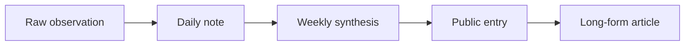

Most personal systems fail because they optimize for intensity instead of stability.

For a simple model, I treat behavior as an iterative update:

$$
\theta_{t+1} = \theta_t - \eta \nabla J(\theta_t)
$$

where $\eta$ is small enough that progress is boring and repeatable.

## A tiny implementation

```python
def gradient_step(theta, grad, learning_rate=0.01):
    return theta - learning_rate * grad
```

## Flow from notes to finished writing



## Visual scratch


